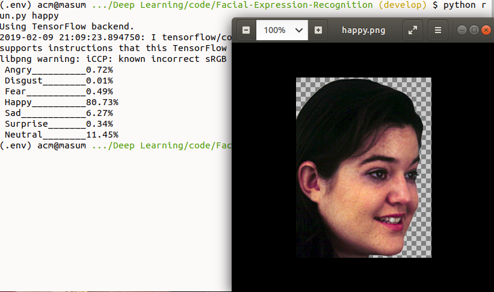

# Facial-Expression-Recognition
In this facial expression recognition project, we have developed convolutional neural networks (CNN). The goal is to classify each facial image into one of the seven facial emotion categories considered in this study. We trained CNN models with different depth using gray-scale images from the Kaggle website. Here we have used Resnet50, SVM, VGG16 methods.


### Support Vector Machine (SVM)
| Accuracy | Rate |
| ------ | ------ |
| Validation | 36.8% |
| Test | 38.5% |

### Resnet50
| Accuracy | Rate |
| ------ | ------ |
| Train | 24.72% |
| Validation | 24.66% |
| Test | 24.71% |

### VGG16
| Accuracy | Rate |
| ------ | ------ |
| Train | 95.1% |
| Validation | 61.4% |
| Test | 60.6% |

# To test this model
We got highest test accuracy with VGG16 model. We use this model to test custom images and webcam video data.
* Install required packages
```sh
$ pip install -r requirements.txt
```

* Test custome images (angry, disgust, fear, happy, sad, surprise, neutral). Use any of the image name as argument
```sh
$ python run.py angry
```



* Test with live webcam video data
```sh
$ python run.py
```

### Resources:
* [Research Paper](http://cs231n.stanford.edu/reports/2017/pdfs/224.pdf) - Recognizing Facial Expressions Using Deep Learning
